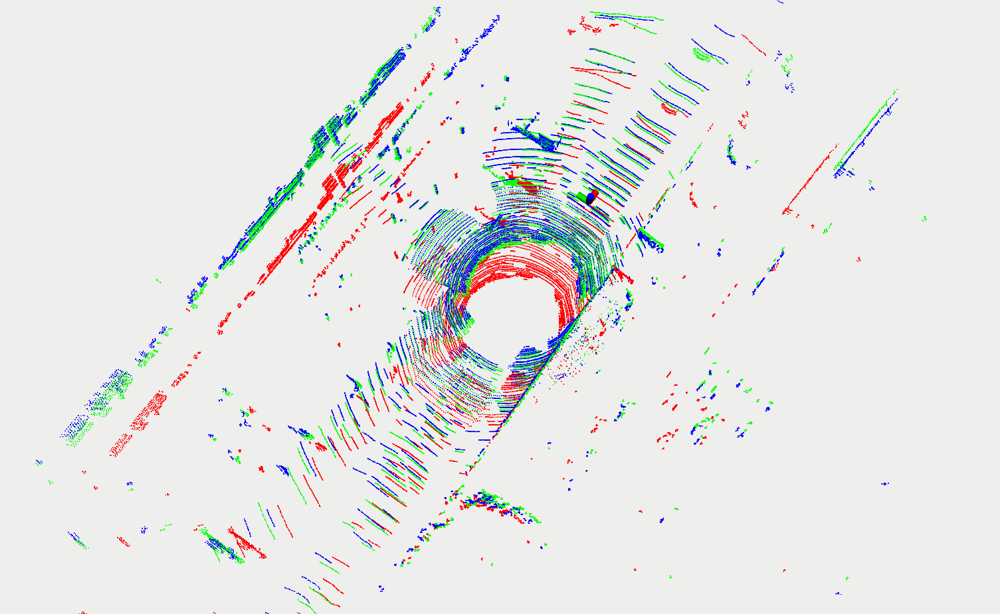

# Quatro-LeGO-LOAM
## Robust Global Registration Quatro (22' ICRA) + LeGO-LOAM (18' IROS)
- For more details for each algorithm, <br>
  Quatro https://github.com/url-kaist/quatro <br>
  LeGO LOAM https://github.com/RobustFieldAutonomyLab/LeGO-LOAM <br>
- In [Quatro](https://github.com/url-kaist/quatro) registration example, we used fast point feature histogram (FPFH), Patchwork and etc to reduce the computational time of feature extraction & matching, i.e. the front-end of global registration, from tens of seconds to almost 0.2 sec.
- *But Quatro-LeGO-LOAM uses only the FPFH descriptor to perform feature matching and then obtain a relative pose through Quatro.*
- **LeGO-LOAM has a large drift, so this is accumulated in large scale maps. For this reason, loop detection using Radius-Search may not generate the loop closure constraint properly. Therefore, if the drift is larger than the used KITTI 05 sequence, it is better to use another descriptor or another Odometry method. Then, You can use ~~[Quatro-SC-LeGO-LOAM]() or [Quatro-Faster-LIO]()~~ alterlatively.** It hasn't been released yet.😭
<!-- (https://github.com/kimdaebeom/Quatro-SC-LeGO-LOAM) (https://github.com/kimdaebeom/Quatro-Faster-Lio) -->

## Test Env.

The code is tested successfully at
* Ubuntu 18.04 LTS + ROS Melodic [main branch](https://github.com/kimdaebeom/Quatro-LeGO-LOAM/tree/main) 
* Ubuntu 20.04 LTS + ROS Noetic [noetic branch](https://github.com/kimdaebeom/Quatro-LeGO-LOAM/tree/noetic)

## Build Quatro

- First of all, you need to build [Quatro (link)](https://github.com/url-kaist/quatro).
* Run the following script. We use [catkin tools](https://catkin-tools.readthedocs.io/en/latest/),

```
mkdir -p ~/catkin_ws/src
cd ~/catkin_ws/src
git clone git@github.com:url-kaist/quatro.git
cd quatro && mkdir build && cd build
# To build Quatro, `pmc-src` should be placed in `build` directory in catkin workspace
# i.e. `~/catkin_ws/build/pmc-src`
cmake ..
mv pmc-src/ ../../../build/
cd ~/catkin_ws
catkin build quatro 
```

**Note that without `pmc-src`**, the below error occurs!

``` 
CMake Error at quatro/CMakeLists.txt:53 (add_subdirectory):
  add_subdirectory given source "~/catkin_ws/build/pmc-src" which
  is not an existing directory.
 ```

## How to run
```
cd ~/catkin_ws/src
git clone {this repo}
cd ..
catkin_make
source devel/setup.bash
roslaunch lego_loam run.launch
```
## Dataset
### KITTI 05 sequence dataset
- Download KITTI 05 sequence dataset with following command. *(15.6GB)*
```
wget {여기에 URL server link를 넣어주세용}
```

- You can run KITTI bag file as below code.
```
rosbag play kitti_sequence_05.bag --clock --topics /kitti/velo/pointcloud
```

### Else
- To generate more bags using other [KITTI raw data](http://www.cvlibs.net/datasets/kitti/eval_odometry.php), you can use the python script [kitti2bag](https://github.com/tomas789/kitti2bag).
- Check the parameters according to the various lidars in *utility.h* : `VLP-16` `HDL-32E` `HDL-64E` `VLS-128` `OS1-16` `OS1-64` `OS0-128`
- You can run your bag file as below code. 
```
rosbag play {your_bag}.bag --topics {pointcloud_topic_message}
```

## Trajectory Evaluation
- I used [evo (link)](https://github.com/MichaelGrupp/evo) to evaluate the trajectories.
- You can install evo using the following command

```
pip install evo --upgrade --no-binary evo
```

- First, you have to modify the directory `traDirectory` in `utility.h` file.
```cpp
// at 62 line of utility.h
extern const string traDirectory = "/home/{your_dir}/lego_loam_trajectory/";
```

- The following command can be used to evaluate the trajectory.
```
evo_traj kitti {your_file_name}.txt --ref={kitti_groundtruth_file_name}.txt -p --plot_mode=xyz
```

- Also, You can use other methods to evaluate your trajectories e.g. metric of trajectory.
```
mkdir results
evo_ape kitti [kitti_file_name].txt [your_file_name].txt -va --plot --plot_mode xyz --save_results results/[name].zip
evo_ape kitti [kitti_file_name].txt [your_file_name].txt -va --plot --plot_mode xyz --save_results results/[name]
```

- You can also save final PCD file. Modify your `pcdDirectory` in `utility.h` file.
```cpp
// at 60 line of utility.h
extern cost string pcdDirectory = "/home/{your_dir}"
```

## Example
- Compare LeGO-LOAM and Quatro-LeGO-LOAM with KITTI 05 dataset. We used **cloudcompare** to visualize pcl.
- You can download cloudcompare with folloing command.

```
snap install cloudcompare
```

- Trajectory is evaluated by [evo (link)](https://github.com/MichaelGrupp/evo).

### Compare PointCloud 

|Dataset|PointCloud|
|:-:|:-:|
|KITTI 05 seq.||

### Compare Trajectory with GroundTruth
- Quatro-Lego-Loam's Trajectory evaluation showed an error of less than **10cm** !!

|Dataset|scene1|scene2|
|:-:|:-:|:-:|
|KITTI 05 seq.|||

## Visualize Quatro Process
- You can visualize Quatro's *source, target, estimation* clouds : `/quatro_src`, `/quatro_tgt`, `/quatro_est`.
- Below visualization picture is an example. `red : source`, `green : target`, `blue : estimation`
<p align="center"></p>
