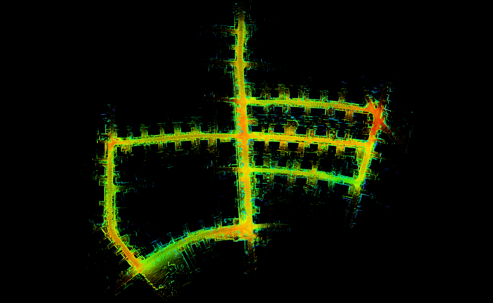

# Quatro-LeGO-LOAM
## Robust Global Registration Quatro (22' ICRA) + LeGO-LOAM (18' IROS)
- For more details for each algorithm, <br>
  Quatro https://github.com/url-kaist/quatro <br>
  LeGO LOAM https://github.com/RobustFieldAutonomyLab/LeGO-LOAM <br>
- In [Quatro](https://github.com/url-kaist/quatro) registration example, we used fast point feature histogram (FPFH), Patchwork and etc to reduce the computational time of feature extraction & matching, i.e. the front-end of global registration, from tens of seconds to almost 0.2 sec.
- *But Quatro-LeGO-LOAM uses only the FPFH descriptor to perform feature matching and then obtain a relative pose through Quatro.*
  
## Test Env.

The code is tested successfully at
* Linux 18.04 LTS
* ROS Melodic

## Build Quatro

- First of all, you need to build [Quatro (link)](https://github.com/url-kaist/quatro).
* Run the following script. We use [catkin tools](https://catkin-tools.readthedocs.io/en/latest/),

```
mkdir -p ~/catkin_ws/src
cd ~/catkin_ws/src
git clone git@github.com:url-kaist/quatro.git
cd quatro && mkdir build && cd build
# To build Quatro, `pmc-src` should be placed in `build` directory in catkin workspace
# i.e. `~/catkin_ws/build/pmc-src`
cmake ..
mv pmc-src/ ../../../build/
cd ~/catkin_ws
catkin build quatro 
```

**Note that without `pmc-src`**, the below error occurs!

``` 
CMake Error at quatro/CMakeLists.txt:53 (add_subdirectory):
  add_subdirectory given source "~/catkin_ws/build/pmc-src" which
  is not an existing directory.
 ```

## How to run
```
cd ~/catkin_ws/src
git clone {this repo}
cd ..
catkin_make
source devel/setup.bash
roslaunch lego_loam run.launch
```
## Dataset
- I used the 05 sequence of KITTI dataset. You can also receive the data set and groundtruth files from [KITTI link](http://www.cvlibs.net/datasets/kitti/eval_odometry.php).
- The extrinsics can be found in the Notes KITTI section below. To generate more bags using other KITTI raw data, you can use the python script provided in "config/doc/kitti2bag". Check the parameters according to the various lidars in *utility.h*.
- You can run your bag file as below code.
```
rosbag play kitti_sequence_05.bag --clock --topics /kitti/velo/pointcloud
```

## Trajectory Evaluation
- I used [evo (link)](https://github.com/MichaelGrupp/evo) to evaluate the trajectories.
- You can install evo using the following command
```
pip install evo --upgrade --no-binary evo
```

- First, you have to modify the directory in **line 342 and 869 of the mapOptimization.cpp** file of src.
```cpp
// line 342 in /src/mapOptimization.cpp
file_obj.open("/home/{your_dir}/{your_file_name}.txt");
// line 869 in /src/mapOptimization.cpp
FileObj.open("/home/{your_dir}/{your_file_name}.txt", std::ios::app);
```

- The following command can be used to evaluate the trajectory.
```
evo_traj kitti {your_file_name}.txt --ref={kitti_groundtruth_file_name}.txt -p --plot_mode=xz
```

- Also, You can use other methods to evaluate your trajectories e.g. metric of trajectory.
```
mkdir results
evo_ape kitti [kitti_file_name].txt [your_file_name].txt -va --plot --plot_mode xz --save_results results/[name].zip
evo_ape kitti [kitti_file_name].txt [your_file_name].txt -va --plot --plot_mode xz --save_results results/[name]
```

## Example
- Example with KITTI 05 sequence dataset.
<p align="center"></p>

- Trajectory is evaluated by [evo (link)](https://github.com/MichaelGrupp/evo).
*Quatro-Lego-Loam's Trajectory evaluation showed an error of less than* **10cm** *!!*
<p align="center"></p>

## Visualize Quatro Process
- You can visualize Quatro's *source, target, estimation* clouds : `/quatro_src`, `/quatro_tgt`, `/quatro_est`.
- Below visualization picture is an example. `red : source`, `green : target`, `blue : estimation`
<p align="center"></p>
